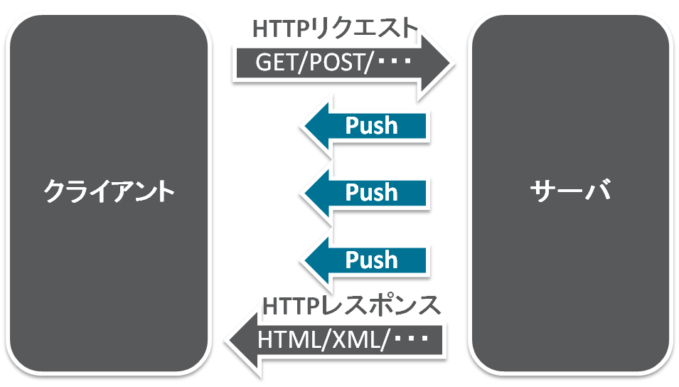
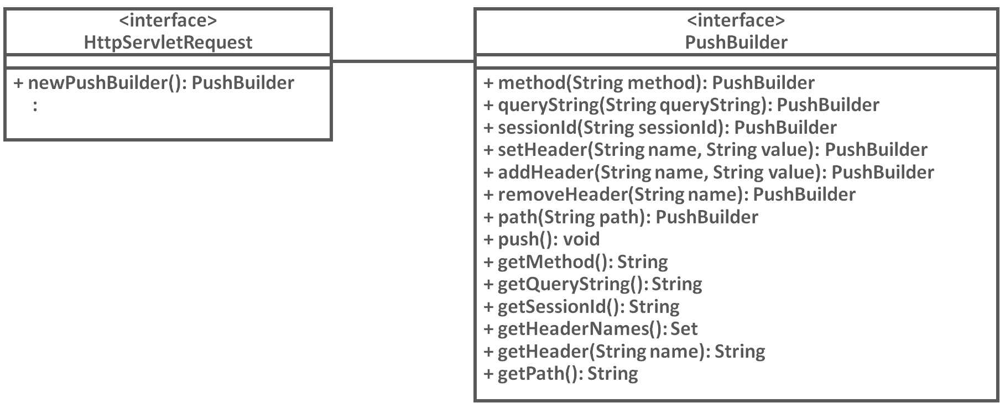
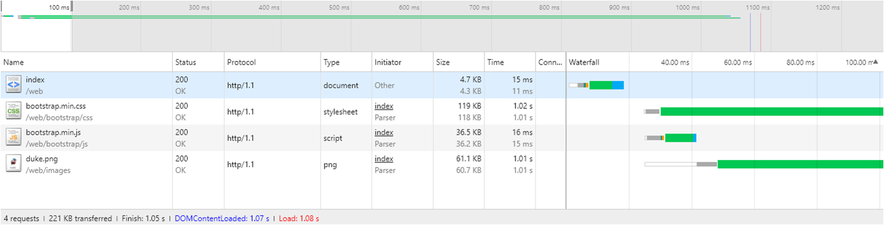
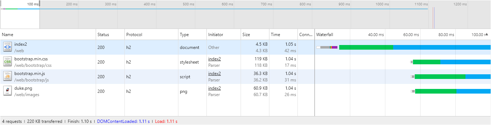
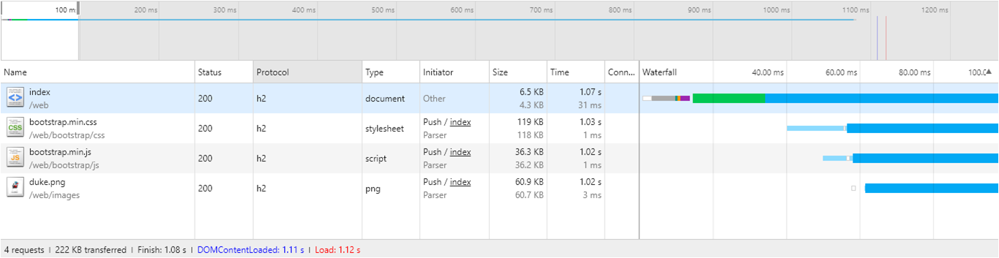

# Sever Push with Servlet 4.0 on Glassfish 5.0-b06

**Servlet 4.0** は、HTTP/2 に対応し、Servlet API として  **Server Push** が実装されます。Sever Push は、HTTP/2 の特長の 1つでクライアントからのリクエストを待たずに、サーバからプロアクティブにレスポンスを返す機能です。現在(2017年5月20日)、策定中の仕様ですが公開されている内容から使用方法を見ていきます。

## 説明
現在策定中のServlet 4.0 の仕様は [JSR 369](https://www.jcp.org/en/jsr/detail?id=369) で公開されています。この JSR 369で盛り込まれた新機能の1つが **HTTP/2 Server Push** です。

### Server Push


HTTP/1.1 までは、通常１つのTCPコネクション上で、１対のリクエスト/レスポンスというものでした。

HTTP/2 では、同一のTCPコネクション上でクライアントからのリクエストを待たずにサーバサイドからプロアクティブに複数のコンテンツレスポンスを返す事ができるようになりました。

この機能を **Server Push** と呼びます。

## 前提：動作環境
- servlet 4.0
  - javax.servlet-api: 4.0.0-b05
- Glassfish 5.0 - b05
  - [glassfish-5.0-b06.zip](http://download.oracle.com/glassfish/5.0/promoted/glassfish-5.0-b06.zip)

動作させるアプリケーション・サーバとしてGlass Fish 5のベータ版を使用します。

## 実装方法

### 1. プロジェクトの作成
Maven で JavaEE プロジェクトを作成します。

```
mvn archetype:generate \
  -DarchetypeGroupId=org.codehaus.mojo.archetypes \
  -DarchetypeArtifactId=webapp-javaee7 \
  -DarchetypeVersion=1.1 \
  -DinteractiveMode=false \
  -DgroupId=${GROUP_ID} \
  -DartifactId=${ARTIFACT_ID} \
  -Dversion=1.0.0-SNAPSHOT \
  -Dpackage=${GROUP_ID} \
  --batch-mode \
  --update-snapshots
```

- GROUP_ID 及び ARTIFACT_ID は適当に設定します。
  - GROUP_ID: パッケージ名相当
  - ARTIFACT_ID: プロジェクト名相当

### 2. pom.xml の編集
#### 2.1. Servlet 4.0 依存関係の追加

作成したJava プロジェクトに含まれているpom.xml を編集します。
以下の、Servlet 4.0 API の依存関係を追加します。Glass Fish 5 には、Servlet 4.0 は統合されているため、スコープは *provided* にしています。

```xml
<dependencies>
    <dependency>
        <groupId>javax.servlet</groupId>
        <artifactId>javax.servlet-api</artifactId>
        <version>4.0.0-b05</version>
        <scope>provided</scope>
    </dependency>
</dependencies>
```

#### 2.2. ビルド定義の追加
ビルド定義を追加します。
追加観点は以下の３つです。
- 出力ファイル名
- コンパイラ設定
- WARファイル設定

```xml
<build>
    <finalName>serverpush</finalName>
    <plugins>
        <plugin>
            <groupId>org.apache.maven.plugins</groupId>
            <artifactId>maven-compiler-plugin</artifactId>
            <version>3.6.1</version>
            <configuration>
                <source>1.8</source>
                <target>1.8</target>
                <compilerArguments>
                    <endorseddirs>${endorsed.dir}</endorseddirs>
                </compilerArguments>
            </configuration>
        </plugin>
        <plugin>
            <groupId>org.apache.maven.plugins</groupId>
            <artifactId>maven-war-plugin</artifactId>
            <version>3.1.0</version>
            <configuration>
                <failOnMissingWebXml>false</failOnMissingWebXml>
                <warSourceDirectory>src/main/webapp</warSourceDirectory>
                <packagingExcludes>
                    %regex[WEB-INF/lib/javax.servlet-api-.*.jar]
                </packagingExcludes>
                <webResources>
                    <resource>
                        <directory>src/main/resources</directory>
                    </resource>
                </webResources>
            </configuration>
        </plugin>
</build>
```

##### 2.2.1. 出力ファイル名
デフォルトではコンテキストルートがWARファイル名になります。サーバで設定可能ですが、デフォルト値として揃えるため出力ファイル名を固定します。

##### 2.2.2. コンパイラ設定
Java 8 のAPIを使用するため、**1.8** を設定します。

##### 2.2.3. WARファイル設定
今回は簡単のため、Annotation でServlet定義を行うのでweb.xmlを使用しません。警告がでないようにfailOnMissingWebXmlを設定します。

### 3. Server Push の実装
Server Push の API を使用するポイントは１つです。
**PushBuiler** オブジェクトを取得する、ということです。Server Push 機能は、PushBuilder から実施します。



Push Builder は、HTTPServletRequest から取得します:

```java
PushBuilder pushBuilder = request.newPushBuilder();
```

この取得したPushBuilder オブジェクトに対して、Server Push （予めクライアント側に送信する）したいコンテンツの配置パスを設定します。パスの設定方法は、以下のようになります:

- **/ から始まる** パス: 絶対パス。/ 以下にコンテキスト・ルートも含めたパスを指定
- **/ から始まらない** パス: 自身のコンテキストから相対パスを指定

```java
pushBuilder.path("bootstrap/css/bootstrap.min.css")
```

追加でヘッダ情報やクエリ文字列を設定することも可能ですが、このままシンプルに **push()** を呼び出す事で path() で設定したコンテンツをクライアント側に送信します。
```java
pushBuilder.push();
```

push() を行うと、コンテンツのパス情報がクリアされます。クリアされたら PushBuilder オブジェクトを再利用して　ServerPush を繰り返し行う事ができます。

## ServerPush 実施状況

### HTTP/1.1
最初にHTMLを取得し、そこからリンクが貼られているコンテンツリソース（CSS / JavaScript / 画像）に対して改めてコンテンツ要求が発行されています。TCPコネクションの再作成も確認ができます。




### HTTP/2 Server Push なし
HTTP/2は、同一TCP接続内で同時に複数のリクエスト/レスポンスを行う事ができるプロトコルです。実際、最初にHTMLを取得した後に、そこからリンクが貼られているコンテンツに対して同時に要求が発行されている事が確認できます。



### HTTP/2 Server Push 実施
Server Push を使用したコンテンツが非同期にプッシュされている事が確認できます。



## Licence
Released under the [MIT license](https://gist.githubusercontent.com/shinyay/56e54ee4c0e22db8211e05e70a63247e/raw/44f0f4de510b4f2b918fad3c91e0845104092bff/LICENSE)

## Author

[shinyay](https://github.com/shinyay)
